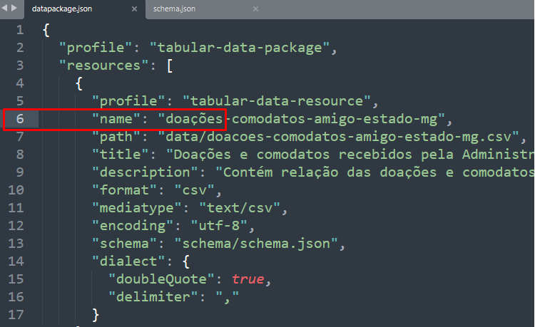
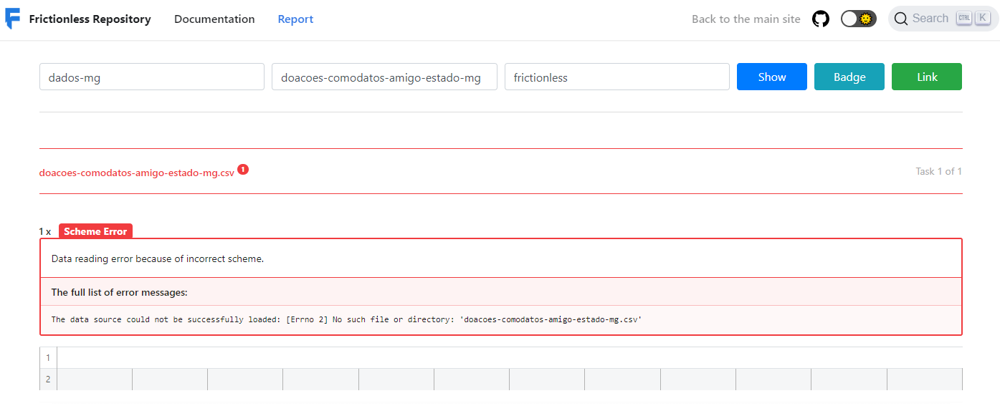
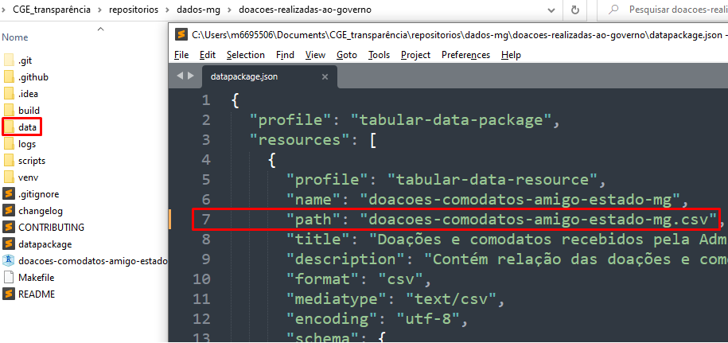
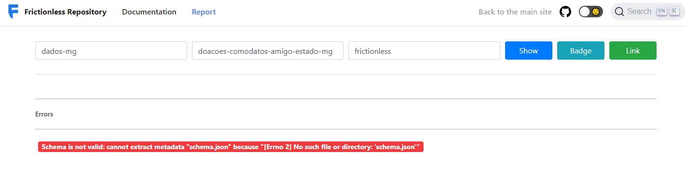
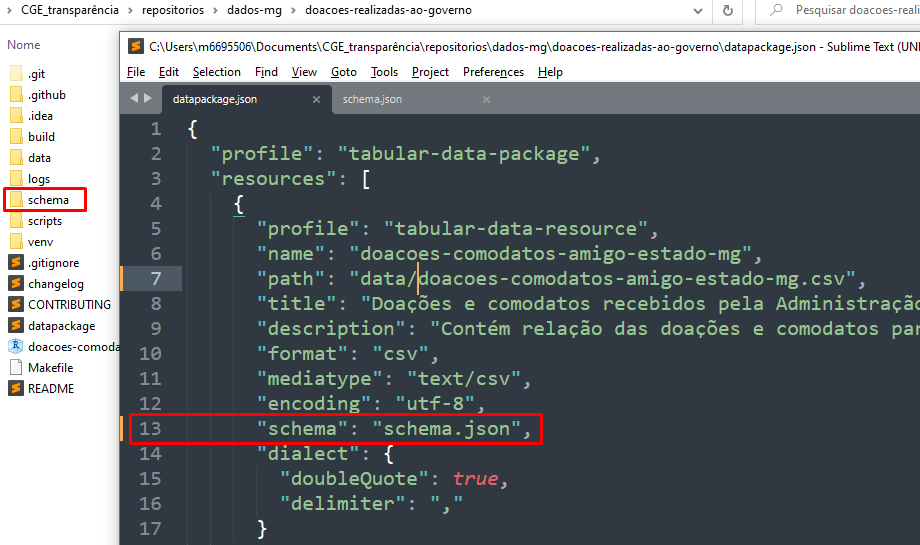

# Propriedades Datapackage

## Nome do recurso

Valor da propriedade `name` do recurso contém caracteres fora da faixa permitida:

````$ frictionless validate datapackage.json
# -------
# invalid: datapackage.json
# -------
=============  ================================================================================================================================================================================================================
code           message                                                                                                                                          
=============  ================================================================================================================================================================================================================
package-error  The data package has an error: "'doa▒▒es-comodatos-amigo-estado-mg' does not match '^([-a-z0-9._/])+$'" at "resources/0/name" in metadata and at "properties/resources/items/properties/name/pattern" in profile
=============  ================================================================================================================================================================================================================
````



* Solução: corrigir a propriedade `name` contendo [especificações legíveis por máquina](https://specs.frictionlessdata.io/data-resource/#metadata-properties) (i.e. letras minúsculas, sem espaços, sem caracteres especiais)


## Caminho `path` 

**i. onde se localizam os arquivos de dados:**

````$ frictionless validate datapackage.json
# -------
# invalid: doacoes-comodatos-amigo-estado-mg.csv
# -------

===  =====  ============  ==============================================================================================================================
row  field  code          message                                               
===  =====  ============  ==============================================================================================================================
            scheme-error  The data source could not be successfully loaded: [Errno 2] No such file or directory: 'doacoes-comodatos-amigo-estado-mg.csv'
===  =====  ============  ==============================================================================================================================
````





* Solução: corrigir o valor da propriedade `path` incorporando o nome da pasta ou URL onde se localiza o recurso, ou corrigindo o nome do recurso, se for o caso

**ii. onde se localizam os arquivos de metadados `datapackage.json`, o `schema.json`, ou o `dialect.json`**

````$ frictionless validate datapackage.json
# -------
# invalid: datapackage.json
# -------
============  =======================================================================================================================
code          message                                                           
============  =======================================================================================================================
schema-error  Schema is not valid: cannot extract metadata "schema.json" because "[Errno 2] No such file or directory: 'schema.json'"
============  =======================================================================================================================
````





* Solução: corrigir o valor da propriedade `path` incorporando o nome da pasta ou URL onde se localiza o `schema` ou `dialect`, ou corrigindo seu nome, se for o caso

## Propriedade `owner_org` (DPCKAN)

Datapackage sem a propriedade `owner_org` obrigatória ou grafada incorretamente ( hífen'-' em vez de underline "_")
