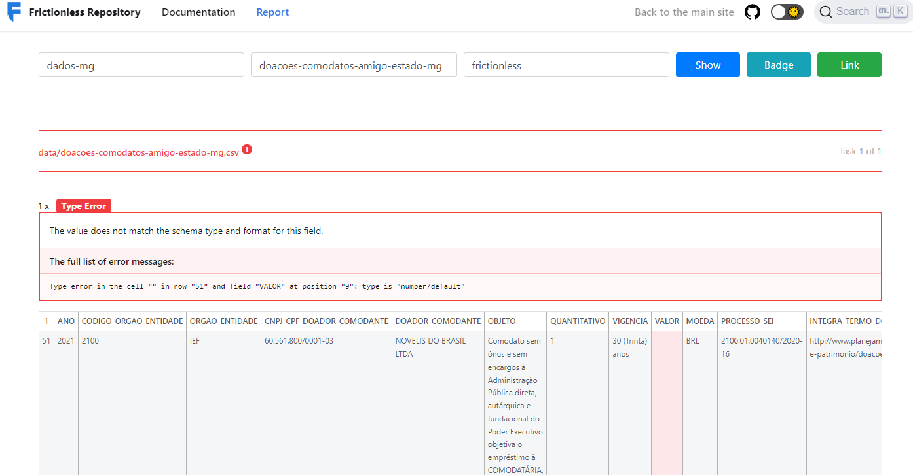
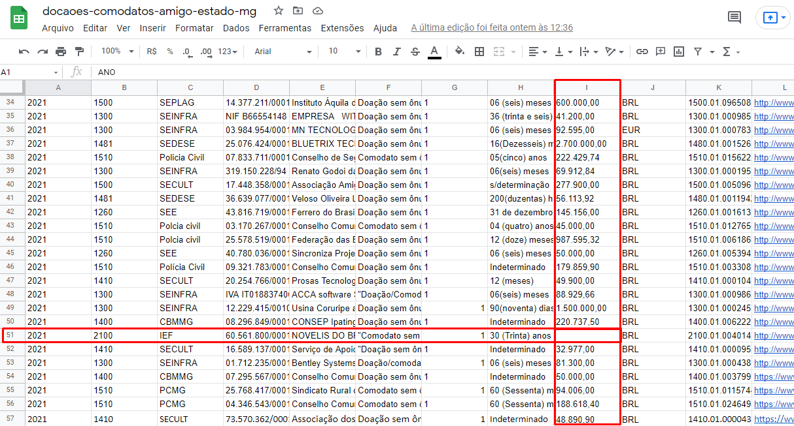
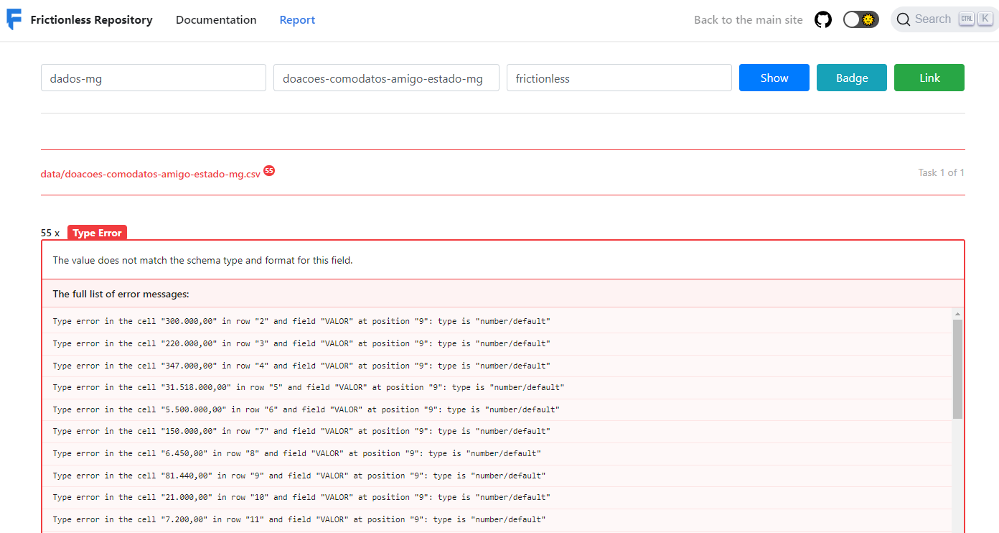
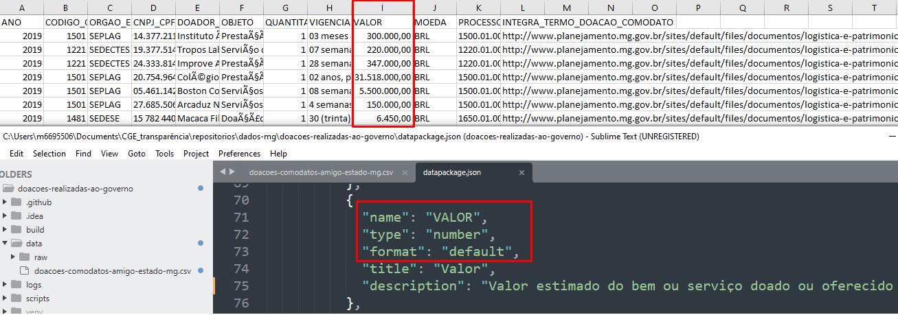
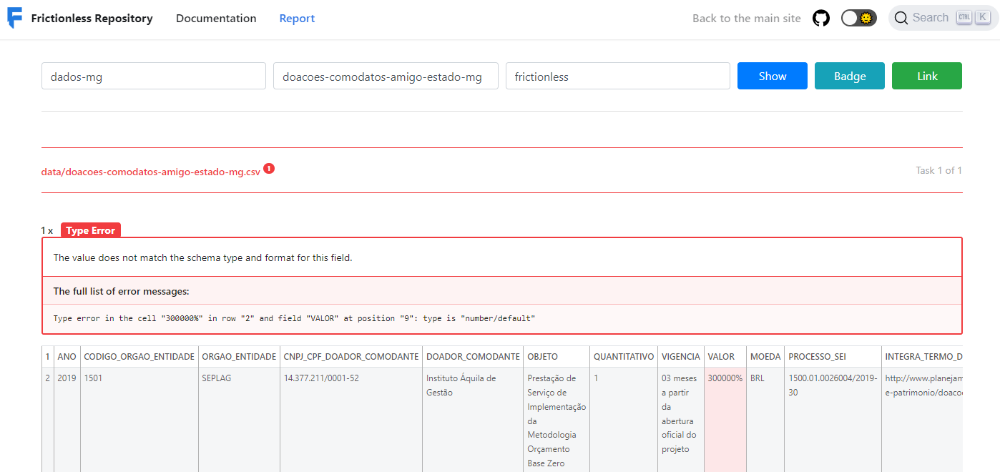
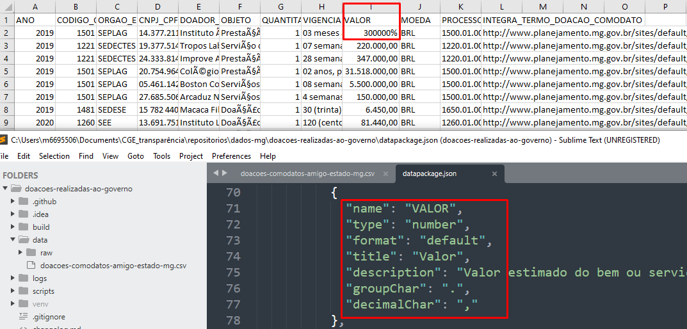
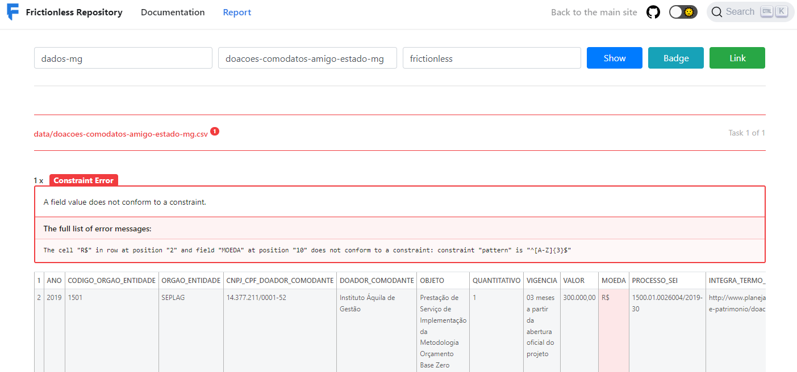
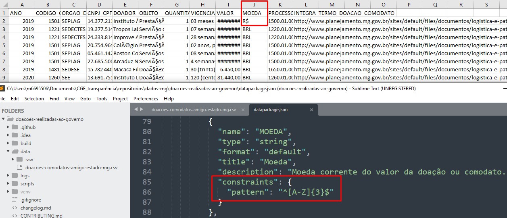

# Formatos de data

## Dado obrigatório ausente

````$ frictionless validate datapackage.json
# -------
# invalid: data/doacoes-comodatos-amigo-estado-mg.csv
# -------

===  =====  ==========  =================================================================================================
row  field  code        message                                                 
===  =====  ==========  =================================================================================================
 51      9  type-error  Type error in the cell "" in row "51" and field "VALOR" at position "9": type is "number/default"
===  =====  ==========  =================================================================================================
````




````          {
            "name": "VALOR",
            "type": "number",
            "format": "default",
            "title": "Valor",
            "description": "Valor estimado do bem ou serviço doado ou oferecido em comodato. Pode ser em moeda nacional ou estrangeira.",
            "groupChar": ".",
            "decimalChar": ","
          }
        ]
        "missingValues": [
          "NA"
        ]
````



* Solução: completar o valor ausente indicado no arquivo do recurso. Se ele não for obrigatório, aplicar 'NA' na célula indicada no arquivo do recurso


## Valor numérico não inteiro

- faltou informar os separadores de milhar (groupChar) e decimais (decimalChar):            

````$ frictionless validate datapackage.json
# -------
# invalid: data/doacoes-comodatos-amigo-estado-mg.csv
# -------

===  =====  ==========  =============================================================================================================
row  field  code        message
===  =====  ==========  =============================================================================================================
  2      9  type-error  Type error in the cell "300.000,00" in row "2" and field "VALOR" at position "9": type is "number/default"
  3      9  type-error  Type error in the cell "220.000,00" in row "3" and field "VALOR" at position "9": type is "number/default"
  4      9  type-error  Type error in the cell "347.000,00" in row "4" and field "VALOR" at position "9": type is "number/default"
````




* Solução: aplicar as propriedades de separador de milhar `groupChar` e/ou separador de decimais `decimalChar`, sempre quando o valor numérico utilizar essa grafia. Alterar o valor da propriedade `type` de `integer` para `number`:

````
"type": "number",
"format": "default",
"title": "Valor",
"groupChar": ".",
"decimalChar": ","
````

## Valor fora das características informadas

  a. type-error

````$ frictionless validate datapackage.json
# -------
# invalid: data/doacoes-comodatos-amigo-estado-mg.csv
# -------

===  =====  ==========  =======================================================================================================
row  field  code        message                                                 
===  =====  ==========  =======================================================================================================
  2      9  type-error  Type error in the cell "300000%" in row "2" and field "VALOR" at position "9": type is "number/default"
===  =====  ==========  =======================================================================================================
````




* Solução: alterar os valores no arquivo do recurso, observando as características das variáveis numéricas indicadas no `datapackage.json`. Caso o problema tenha sido na descrição do dado, alterar as propriedades necessárias no `datapackage.json`  
  
  b. constraint-error - pattern

````
$ frictionless validate datapackage.json
# -------
# invalid: data/doacoes-comodatos-amigo-estado-mg.csv
# -------

===  =====  ================  ==============================================================================================================================================
row  field  code              message                                                                                                                           
===  =====  ================  ==============================================================================================================================================
  2     10  constraint-error  The cell "R$" in row at position "2" and field "MOEDA" at position "10" does not conform to a constraint: constraint "pattern" is "^[A-Z]{3}$"
===  =====  ================  ==============================================================================================================================================

````




* Solução: alterar os valores no arquivo do recurso, observando as características das variáveis indicadas no `datapackage.json`. Caso o problema tenha sido na descrição do dado, alterar as propriedades necessárias no `datapackage.json`
