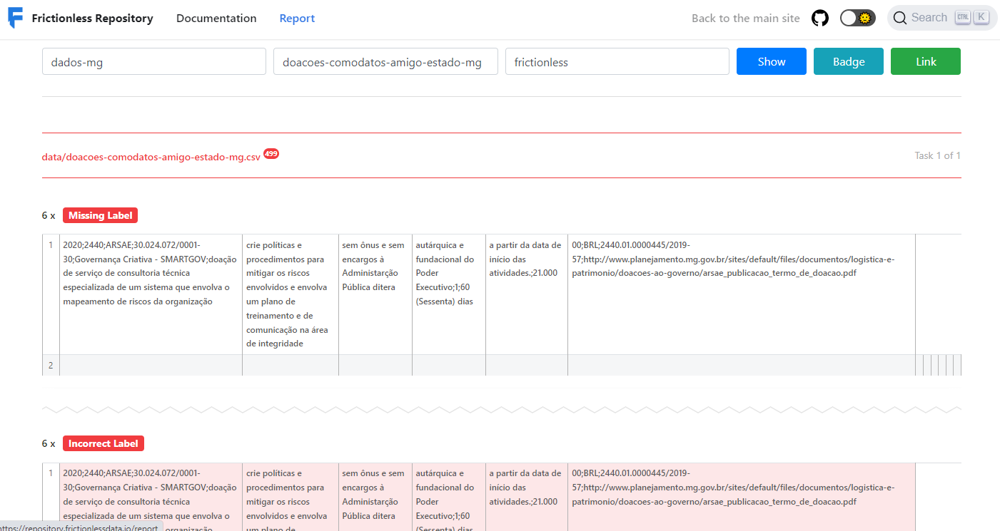
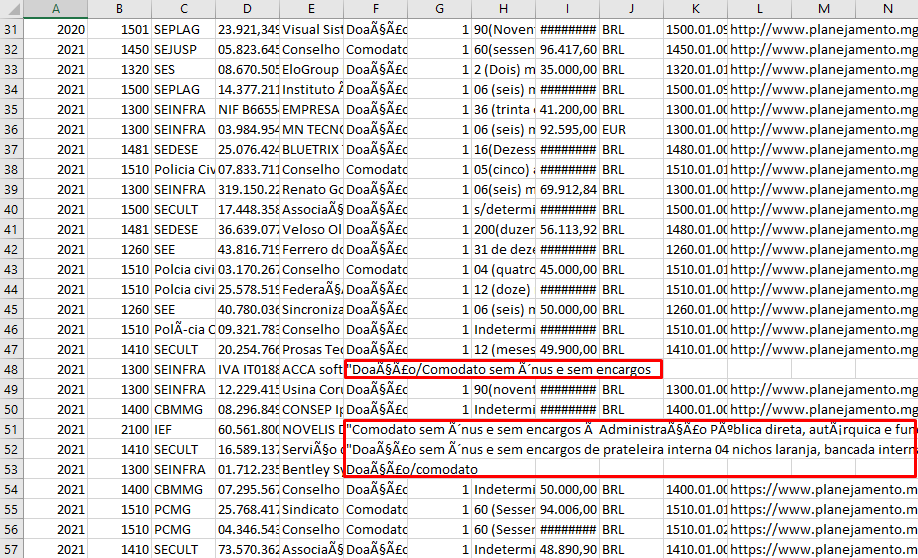

## Delimitadores

Valores fora dos campos delimitadores (, ou ;):

````
$ frictionless validate datapackage.json
# -------
# invalid: datapackage.json
# -------
==========  ======================================
code        message
==========  ======================================
task-error  The task has an error: 'fieldPosition'
==========  ======================================
````





* Solução: verificar se colunas de texto contêm ',' e/ou ';' que possam estar sendo interpretados como delimitadores de coluna. Delimitar os valores das colunas de texto em suas respsectivas células, utilizando aspas no editor de `csv`)
