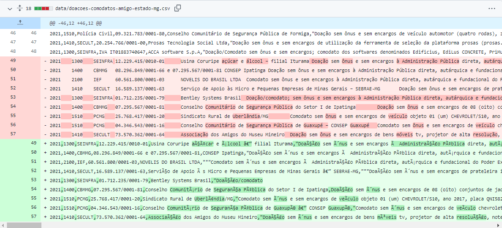
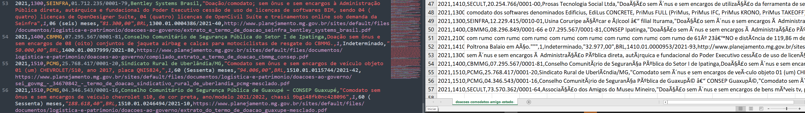

## Arquivo de dados sem encoding `utf-8` 

a. encoding Western, Latin, Windows...

b. encoding UTF-8 sem Byte Order Mask (BOM)

* Solução: gerar o arquivo `csv` com o BOM. No editor de texto Sublime, 'Save with Encoding --> UTF-8 with BOM'